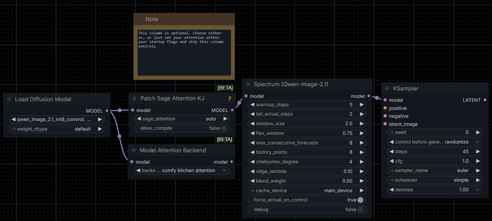
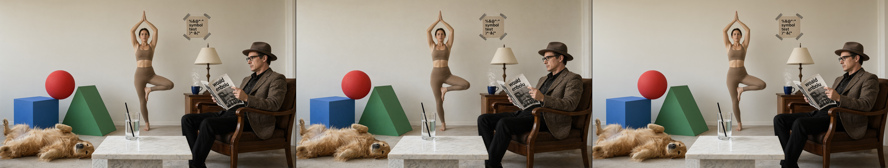
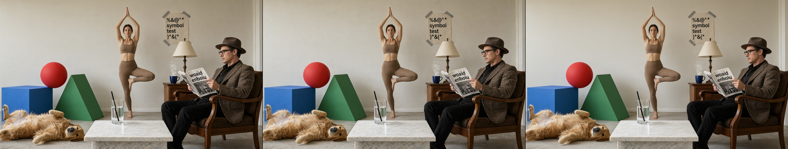
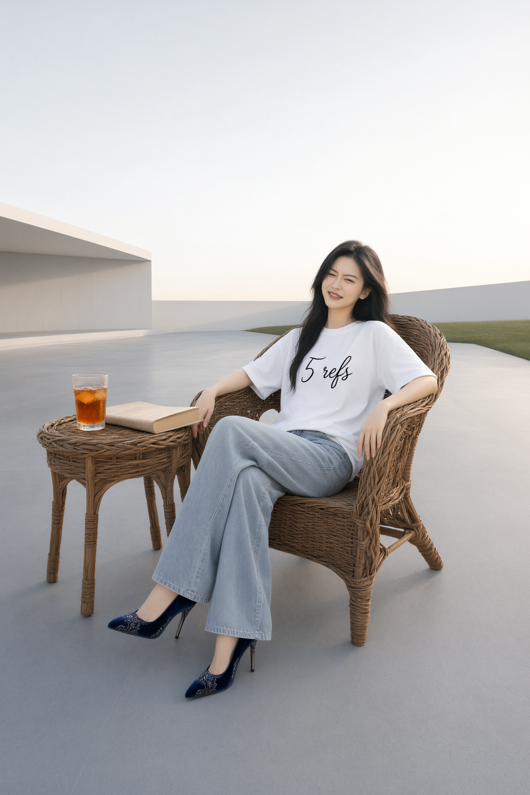
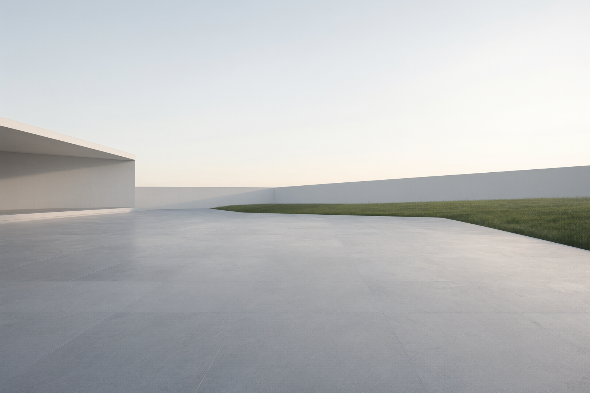
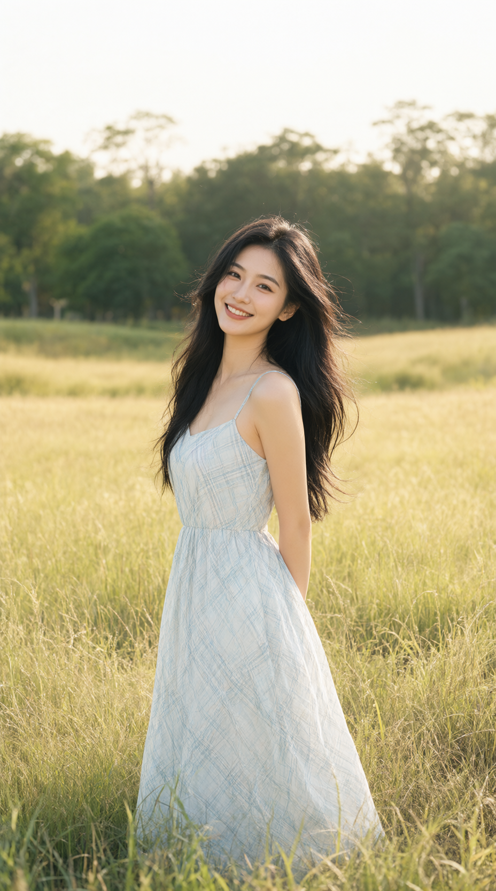
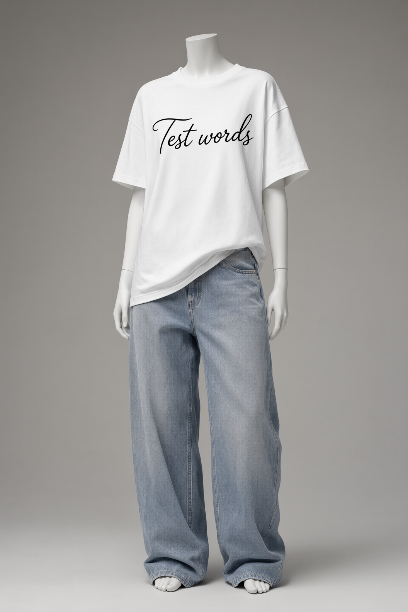

# **Disclaimer: This was fully vibe coded in one shot by GLM-5.3**

# What is this?
A single custom node that shows ~2x speedup compared to base Qwen 2.1 image generation times for a slight quality hit. This is not a replacement for your choice of attention. All tests were done on an 12GB 3060.

# Quickstart


* Simply insert the spectrum node before the `KSampler` node

Basic example workflows provided


# Quick T2I Notes
* Generations with spectrum often look very similar to the base step generation, but softer and more airbrushed. Good for quick prompt iteration.

Random tests done by me with the default spectrum node values (3060 12GB, 928x1664, 25 steps, **diffusion time only**, fixed seed, CFG 1, int8convrot, **SAMPLE SIZE 1**, Euler + Simple, Sage attention):
| Model / Test | Steps | CFG | Diffusion Time | Speed | Task | Resolution |
| :--- | :---: | :---: | :---: | :---: | :---: | :---: |
| Base | 25 | 1 | ~49s | 1.97s/it | T2I | 928x1664 |
| Base | 25 | 1 | ~49s | 1.98s/it | T2I | 928x1664 |
| Base | 25 | 1 | ~57s | 2.31s/it | T2I | **1328x1328** |
| Easy Cache | 25 | 1 | ~30s | 1.23s/it | T2I | 928x1664 |
| Easy Cache | 25 | 1 | ~30s | 1.20s/it | T2I | 928x1664 |
| Easy Cache | 25 | 1 | ~35s | 1.44s/it | T2I | **1328x1328** |
| Spectrum | 25 | 1 | ~22s | 1.10it/s | T2I | 928x1664 |
| Spectrum | 25 | 1 | ~22s | 1.09it/s | T2I | 928x1664 |
| Spectrum | 25 | 1 | ~26s | 1.06s/it | T2I | **1328x1328** |
| Spectrum | **45** | 1 | ~28s | 1.56it/s | T2I | 928x1664 |
| Spectrum | **45** | 1 | ~29s | 1.55it/s | T2I | 928x1664 |
| Spectrum | **45** | 1 | ~34s | 1.32it/s | T2I | **1328x1328** |
| Spectrum | 25 | **4** | ~45s | 2.81s/it | T2I | 928x1664 |
| Base | 25 | 1 | ~2:53 | 6.95s/it | T2I | 2688x1536 |
| Easy Cache | 25 | 1 | ~1:45 | 4.20s/it | T2I | 2688x1536 |
| Spectrum | 25 | 1 | ~1:16 | 3.06s/it | T2I | 2688x1536 |
| Base | **45** | 1 | ~5:25 | 7.23s/it | T2I | 2688x1536 |
| Easy Cache | **45** | 1 | ~3:08 | 4.20s/it | T2I | 2688x1536 |
| Spectrum | **45** | 1 | ~1:47 | 2.38s/it | T2I | 2688x1536 |

* All 4k tests were added at the bottom

* Easy cache was ran with `reuse_threshold = 0.20`, `start_percent = 0.20`, and `end_percent = 0.70`
* Tests ran with sage attention, though fully compatible with comfy kitchen attention (add '--use-ck-attention' to your startup flags or use the `Model Attention Backend` node with `comfy kitchen attention` selected)
* 45 steps was chosen as I found this is generally where quality becomes more consistent.
* It _can_ run with easy cache, and it is technically faster, and it generates different images. Use at your own discretion. (tested with `Model Loader` => `Patch Sage Attention KJ / Model Attention Backend / Skip (global attention set with startup flag)` => `Easy Cache (0.2,0.2,0.7)` => `Spectrum (default settings)` => `KSampler`)
* Will get around to averaging values later when I have the time, purely a messy table with the times from the example images added for more data.

For equivalent steps, it is arguably equal quality compared to easy cache (in some cases easy cache ends up creating artifacts while spectrum always looks airbrushed), but it seems to be far faster, allowing me to fit up to around 45 steps while still being faster than Easy Cache.

# Quick I2I notes
* Transparency still works fine, though I recommend following the prompting tip from the official [HuggingFace space](https://huggingface.co/spaces/Qwen/Qwen-Image-2.1)
> For transparent image generation, use the following prompt format and replace xxxxx with your image description: `This is an RGBA image with transparency. xxxxx The image has alpha channel and the background is transparent.`
* Reminder: You can't use the Flux 2/Mage Flow VAE Encode/Decode trick to reduce the lattice grid for transparent images as these VAEs do not support an alpha channel. It will turn the alpha channel pink/magenta.
* Tested with up to 3 reference images. Worked perfectly fine.

| Model / Test | Steps | Diffusion Time | Speed | Reference Images | Task | Resolution |
| :--- | :---: | :---: | :---: | :---: | :---: | :---: |
| Base | 25 | ~37s | 1.50s/it | 1 | I2I | 1 MP |
| Easy Cache | 25 | ~23s | 1.05it/s | 1 | I2I | 1 MP | 
| Spectrum | 25 | ~16s | 1.48it/s | 1 | I2I | 1 MP |
| Spectrum | **45** | ~21s | 2.08 it/s | 1 | I2I | 1 MP |
| Spectrum | 25 | ~51s | 2.7s/it | 5 | I2I | 1056x1584 |

<details>
   <summary>Old tests with multiple Reference images tested.</summary>
   
   Random tests done by me with default spectrum node values (3060 12GB, 1 megapixel, 45 steps, **diffusion time only**, fixed seed, CFG 1, int8convrot, **SAMPLE SIZE 1**, Euler + Simple, Sage attention)
   | Ref. Imgs | Steps | Diffusion Time | Speed |
   | :--- | :---: | :---: | :---: |
   | 1 | 45 | ~21s | 2.08 it/s |
   | 2\* | 45 | ~26s | 1.73 it/s |
   | 3\* | 45 | ~30s | 1.49 it/s |
   | 1 | **25** | ~16s | 1.49 it/s |
   | 2\* | **25** | ~20s | 1.22 it/s |
   | 3\* | **25** | ~23s| 1.07 it/s |
</details>


*_You will feel a larger time gap as reference images increase due to the extra conditioning required._
* All images were passed at 1 megapixel, and all tests were ran with spectrum.
* Tests ran with sage attention, though fully compatible with comfy kitchen attention (add '--use-ck-attention' to your startup flags or use the `Model Attention Backend` node with `comfy kitchen attention` selected)
* 45 steps was chosen as I found this is generally where quality becomes more consistent.
* I did not do in-depth testing against the base/easy cache as I did some light testing and found similar results to T2I

# Quick Examples
**T2I**
.png)
<details>
<summary><b>Click to show individual pictures + more info</b></summary>
<br>

<table width="100%">
  <tr>
    <td align="center" width="25%"></td>
    <td align="center" width="25%"></td>
    <td align="center" width="25%"></td>
    <td align="center" width="25%"></td>
  </tr>
  <tr>
    <td align="center"><b>Base (~49s 1.97s/it)</b></td>
    <td align="center"><b>Easy Cache (~30s 1.23s/it)</b></td>
    <td align="center"><b>Spectrum (25) (~22s 1.10it/s)</b></td>
    <td align="center"><b>Spectrum (45) (~28s 1.56it/s)</b></td>
  </tr>
</table>

* The time for each is simply the time it spent in the KSampler for more consistent comparisons, not a complete clip encode + KSampler + VAE decode process.

</details>

> Cinematic full-body portrait of a stunningly beautiful Chinese woman standing gracefully in a sun-drenched clearing amidst a vast, undulating field of tall, golden-green meadow grass. She is wearing a delicate, lightweight summer sundress with a subtle white and pale light-blue plaid pattern, featuring thin, elegant spaghetti straps that rest gently on her shoulders. Her long, lustrous, raven-black hair flows freely, caught in a gentle breeze, dancing around her face and shoulders. She is looking directly into the camera lens with a warm, radiant, and captivating smile, her eyes sparkling with life. The background features a dense, soft-focus line of lush, verdant trees under a bright, hazy sky, creating a beautiful bokeh effect. The lighting is soft, warm, and ethereal, reminiscent of the golden hour, casting a gentle glow on her skin and illuminating the individual blades of grass.
* Left to right: Base, Easy cache, Spectrum (25), Spectrum (45)
* 928x1664, Euler/Simple, Sage Attention, CFG 1, Easy cache values at `.2, .2, .7`, 25 steps unless specified otherwise.
* Note the lattice shaped grid within the grass (this seems to be an issue with the VAE), as well as the degradation in outlines in things like hair as well as the degradation in the quality of the skin.
* The image composition remains roughly the same for Spectrum (25) as the base, at lower finer details.

.png)
<details>
<summary><b>Click to show individual pictures + more info</b></summary>
<br>

<table width="100%">
  <tr>
    <td align="center" width="25%"></td>
    <td align="center" width="25%"></td>
    <td align="center" width="25%"></td>
    <td align="center" width="25%"></td>
  </tr>
  <tr>
    <td align="center"><b>Base (~57s 2.31s/it)</b></td>
    <td align="center"><b>Easy Cache (~35s 1.44s/it)</b></td>
    <td align="center"><b>Spectrum (25) (~26s 1.06s/it)</b></td>
    <td align="center"><b>Spectrum (45) (~34s 1.32it/s)</b></td>
  </tr>
</table>

* The time for each is simply the time it spent in the KSampler for more consistent comparisons, not a complete clip encode + KSampler + VAE decode process.

</details>

> A highly detailed, cinematic close-up shot of a pristine, rectangular white sign held steady in the center of the frame. The sign is held by two hands entering from the extreme periphery of the image, with the person's body remaining entirely out of frame to ensure they do not distract from the subject. On the sign, the word "Hello" is written in a large, expressive, and highly creative hand-lettered calligraphy font, featuring elegant flourishes and artistic swirls. The texture of the white cardstock is visible under soft, diffused studio lighting, creating gentle shadows and a sense of depth. The background is a soft-focus, minimalist bokeh of neutral pastel tones, ensuring all attention is drawn to the sharp, crisp typography of the sign
* Left to right: Base, Easy cache, Spectrum (25), Spectrum (45)
* 1328x1328, Euler/Simple, Sage Attention, CFG 1, Easy cache values at `.2, .2, .7`, 25 steps unless specified otherwise.
* This example is just to show the potential gains from being able to fit higher steps.


**4k T2I test**

<details>
<summary><b>Click to show individual pictures + more info</b></summary>
<br>

<table width="100%">
  <tr>
    <td align="center" width="33%"></td>
    <td align="center" width="33%"></td>
    <td align="center" width="33%"></td>
  </tr>
  <tr>
    <td align="center"><b>Base (~2:53 6.95s/it)</b></td>
    <td align="center"><b>Easy Cache (~1:45 4.20s/it)</b></td>
    <td align="center"><b>Spectrum (~1:16 3.06s/it)</b></td>
  </tr>
</table>

* The time for each is simply the time it spent in the KSampler for more consistent comparisons, not a complete clip encode + KSampler + VAE decode process.

</details>
<details>
   <summary>Click to show prompt</summary>
   
   > A wide-angle landscape shot captures a spacious, lived-in interior room with a balanced composition. In the center of the frame, an adult woman performs a graceful yoga tree pose, balanced on one leg with her hands joined above her head. She is dressed in a stylish, form-fitting athletic outfit consisting of high-waisted leggings and a coordinated cropped top. To the far right, a man is seated in a classic wooden armchair, leaning back slightly. He wears a textured brown tweed jacket over black slacks, a wide-brimmed fedora, and black-rimmed glasses. He holds a magazine open, clearly displaying the text "woaid enboiu!". Next to his chair stands a small wooden nightstand topped with a traditional desk lamp. Directly beneath the lamp, a navy blue ceramic mug sits, releasing a visible swirl of steam from a dark liquid inside. In the left third of the foreground, a golden retriever lies comfortably on its back with its paws in the air. Positioned immediately behind the dog are three geometric shapes: a blue cube sits on the floor, a green triangular prism stands upright beside it, and a red sphere is balanced precariously between the two. These three items are rendered with flat, matte textures and harsh, uniform lighting, lacking realistic shadows or depth. In the immediate center foreground, a short white marble table holds a clear cylindrical glass filled 70% with water and containing an opaque black straw. The background wall features a weathered poster secured with strips of grey duct tape, displaying the printed text "%&@^!* symbol test )\*&(\*". The room is bathed in soft, natural light coming from an unseen window, creating a domestic and serene atmosphere.
   
</details>

* **25** steps, euler + simple, sage attention, easy cache values at 0.2,0.2,0.7 and spectrum at default values
* Quality loss is visible in the texture of the tweed jacket, dog's fur, and the skin textures
* Straw seems to be properly refracting within the glass, as well as the green triangular prism in all 3 images
* Failed at generating an exclamation mark in every case


<details>
<summary><b>Click to show individual pictures + more info</b></summary>
<br>

<table width="100%">
  <tr>
    <td align="center" width="33%"></td>
    <td align="center" width="33%"></td>
    <td align="center" width="33%"></td>
  </tr>
  <tr>
    <td align="center"><b>Base (~5:25 7.23s/it)</b></td>
    <td align="center"><b>Easy Cache (~3.08 4.20s/it)</b></td>
    <td align="center"><b>Spectrum (~1:47 2.38s/it)</b></td>
  </tr>
</table>

* The time for each is simply the time it spent in the KSampler for more consistent comparisons, not a complete clip encode + KSampler + VAE decode process.

</details>
<details>
   <summary>Click to show prompt</summary>
   
   > A wide-angle landscape shot captures a spacious, lived-in interior room with a balanced composition. In the center of the frame, an adult woman performs a graceful yoga tree pose, balanced on one leg with her hands joined above her head. She is dressed in a stylish, form-fitting athletic outfit consisting of high-waisted leggings and a coordinated cropped top. To the far right, a man is seated in a classic wooden armchair, leaning back slightly. He wears a textured brown tweed jacket over black slacks, a wide-brimmed fedora, and black-rimmed glasses. He holds a magazine open, clearly displaying the text "woaid enboiu!". Next to his chair stands a small wooden nightstand topped with a traditional desk lamp. Directly beneath the lamp, a navy blue ceramic mug sits, releasing a visible swirl of steam from a dark liquid inside. In the left third of the foreground, a golden retriever lies comfortably on its back with its paws in the air. Positioned immediately behind the dog are three geometric shapes: a blue cube sits on the floor, a green triangular prism stands upright beside it, and a red sphere is balanced precariously between the two. These three items are rendered with flat, matte textures and harsh, uniform lighting, lacking realistic shadows or depth. In the immediate center foreground, a short white marble table holds a clear cylindrical glass filled 70% with water and containing an opaque black straw. The background wall features a weathered poster secured with strips of grey duct tape, displaying the printed text "%&@^!* symbol test )\*&(\*". The room is bathed in soft, natural light coming from an unseen window, creating a domestic and serene atmosphere.
   
</details>

* **45** steps, euler + simple, sage attention, easy cache values at 0.2,0.2,0.7 and spectrum at default values
* Quality loss is visible in the texture of the tweed jacket, dog's fur, and the skin textures
* Straw seems to be properly refracting within the glass, as well as the green triangular prism in all 3 images
* Failed at generating an exclamation mark in every case (within the '%&@^!*' on the wall poster, and at the end of teh "enboiu!" string on the newspaper)


**I2I**
.png)
<details>
<summary><b>Click to show individual pictures + more info</b></summary>
<br>

<table width="100%">
  <tr>
    <td align="center" width="25%"></td>
    <td align="center" width="25%"></td>
    <td align="center" width="25%"></td>
    <td align="center" width="25%"></td>
  </tr>
  <tr>
    <td align="center"><b>Base (~37s 1.50s/it)</b></td>
    <td align="center"><b>Easy Cache (~23s 1.05it/s)</b></td>
    <td align="center"><b>Spectrum (25) (~16s 1.48it/s)</b></td>
    <td align="center"><b>Spectrum (45) (~21s 2.08 it/s)</b></td>
  </tr>
</table>

* The time for each is simply the time it spent in the KSampler for more consistent comparisons, not a complete clip encode + KSampler + VAE decode process.

</details>

> Replace the text "Hello" on the white card with its Chinese translation "你好", and render the new text in solid black color. The replacement "你好" must be set at the same large display size, centered on the white card in the same position as the original "Hello", using an elegant flowing brush-calligraphy script with graceful sweeping swashes and flourishes that mirror the original cursive lettering's dynamic connected strokes, and it must retain the same raised three-dimensional paper-cut depth effect with soft subtle drop shadows on the card surface, now rendered in matte black instead of white. Preserve all non-text visual elements exactly as they appear: the two hands gripping the card at the left and right edges, the plain white matte card, and the soft pastel beige-pink-gray gradient background, with unchanged lighting, perspective, and photographic quality.
* Left to right: Base, Easy cache, Spectrum (25), Spectrum (45)
* 1 MP (1024x1024), Euler/Simple, Sage Attention, CFG 1, Easy cache values at `.2, .2, .7`, 25 steps unless specified otherwise.
* Used the Spectrum (45) result from the second T2I example as the starting image.
* I recommend cropping input images to multiples of 64 pixels.


<details>
   <summary> Reference images used.</summary>
   <br>
   <table border="0">
      <!-- First Row of Images -->
      <tr>
         <td></td>
         <td></td>
         <td></td>
      </tr>
      <!-- First Row of Labels -->
      <tr align="center">
         <td><sub>Image 1</sub></td>
         <td><sub>Image 2</sub></td>
         <td><sub>Image 3</sub></td>
      </tr>
      <!-- Second Row of Images -->
      <tr>
         <td></td>
         <td></td>
         <td></td> <!-- Empty cell to keep the grid aligned -->
      </tr>
      <!-- Second Row of Labels -->
      <tr align="center">
         <td><sub>Image 4</sub></td>
         <td><sub>Image 5</sub></td>
         <td></td>
      </tr>
   </table>
</details>

> 在\<image1\>的室外场景中，将\<image2\>中的长发女孩植入画面，让她坐在\<image5\>中的藤编扶手椅上。女孩穿着\<image3\>中展示套装的白色宽松圆领短袖T恤和浅蓝色阔腿牛仔裤，T恤胸前原黑色手写体文字"Test words"替换为黑色手写花体字"5 refs"，字体风格与原文一致、居中印在胸部位置；脚上穿着\<image4\>中的深蓝色丝绒细高跟鞋，鞋面银色刺绣花纹完整保留。女孩以正面视角呈现，身体向后靠坐在椅背里，双手分别搭在藤椅两侧扶手上，双腿在身前交叉，面朝镜头并对观众皱眉。女孩的面部特征、长黑直发、肤色与\<image2\>完全一致。藤椅按\<image5\>中的样式完整保留：棕色藤编弧形扶手椅、旁边藤编小圆桌以及桌上的玻璃杯装冰茶和米色书本。女孩与藤椅、圆桌的接触处产生自然的接触阴影，阴影方向与\<image1\>场景的柔和自然光一致，人物边缘过渡自然无抠图痕迹。将女孩、藤椅和圆桌整体置入\<image1\>的开阔场地中，保持\<image1\>左侧白色平顶建筑体块、远处白色围墙、右侧绿色草坪和灰白色天空完全不变，人物与家具的底部与\<image1\>的浅灰色铺装地面自然衔接并投下与场景光照方向一致的柔和阴影。T恤面料褶皱跟随女孩后靠坐姿自然形变，牛仔裤在交叉腿处产生自然布料拉伸与褶皱，高跟鞋踩在地面上时鞋跟与鞋头方向符合透视。
<details>
   <summary>Translated Prompt (Google translate)</summary>

   > In the outdoor scene of \<image1\>, the long-haired girl from \<image2\> is inserted into the frame, sitting in the wicker armchair from \<image5\>. The girl wears a white, loose-fitting, round-neck short-sleeved T-shirt and light blue wide-leg jeans, as shown in \<image3\>. The original black handwritten text "Test words" on the chest of the T-shirt has been replaced with black handwritten cursive "5 refs," with the font style consistent with the original and centered on the chest. She wears dark blue velvet stilettos from \<image4\>, with the silver embroidered pattern on the shoe surface fully preserved. The girl is presented from a frontal perspective, leaning back in the chair, with her hands resting on the armrests on either side of the wicker armchair, her legs crossed in front of her, facing the camera and frowning at the viewer. The girl's facial features, long, straight black hair, and skin tone are completely consistent with \<image2\>. The wicker armchair is fully preserved in the style of \<image5\>: a brown wicker curved armchair, a small wicker round table next to it, and a glass of iced tea and a beige book on the table. The girl's contact with the wicker chair and round table creates natural contact shadows, the direction of which aligns with the soft, natural light of the scene in \<image1\>. The edges of the figures transition naturally without any cutout artifacts. The girl, wicker chair, and round table are placed within the open space of \<image1\>, maintaining the white flat-roofed building on the left, the white wall in the distance, the green lawn on the right, and the gray-white sky unchanged. The bottoms of the figures and furniture blend naturally with the light gray paved ground of \<image1\>, casting soft shadows consistent with the direction of the scene's lighting. The folds in the T-shirt fabric naturally deform with the girl's leaning posture, the jeans create natural stretching and folds at the crossed legs, and the heels and toes of the high heels conform to perspective when they touch the ground.
   
</details>

* All reference images were AI generated with Qwen-Image-2.1
* Notably, failed to change the smile to a frown
* Managed to retain some finer detail, like the silver heels on the high heels, and the matte tip of the heels
* Successfully changed the text on the shirt in the same style
* Was originally aiming for a 10 image reference test, but was OOM-ing so I cut down images
* Test was run with euler + simple, sage attention, a manually sized latent at 1056x1584, `Text Encode Qwen Image 2.1` resolution set to 1024, Spectrum node was stock except for `cache_device` changed to `cpu`, 25 steps.

Diffusion time: 51s (2.07s/it)


That's all from me, everything after this is AI slop.

# ComfyUI-Spectrum-QwenImage21

# **Spectrum sampling acceleration for Qwen-Image-2.1 in ComfyUI.**

This custom node applies **Spectrum** — the training-free diffusion sampling
accelerator from the paper *"Adaptive Spectral Feature Forecasting for
Diffusion Sampling Acceleration"* (arXiv:2603.01623, CVPR 2026) — to
ComfyUI's native **Qwen-Image-2.1** model (text-to-image and editing,
including RGBA and multi-reference workflows).

On selected denoising steps the node skips the entire 32-block Qwen
transformer and instead *forecasts* its final hidden state with an online,
ridge-regularized Chebyshev fit over the real steps, running only the cheap
output head (`time_text_embed → norm_out → proj_out`). This typically skips
~65–70% of the transformer passes at the paper's "moderate" setting while
keeping outputs visually close to full sampling.

- Paper: <https://arxiv.org/abs/2603.01623>
- Official code: <https://github.com/hanjq17/Spectrum>
- Qwen-Image-2.1: <https://huggingface.co/Qwen/Qwen-Image-2.1>

## Why this works on Qwen-Image-2.1

Qwen-Image-2.1's diffusion transformer is an ideal Spectrum target:

1. **Single-stream DiT + cheap tail.** 32 `QwenImage21TransformerBlock`
   layers process the packed sequence, and only the target-image tokens
   enter the output head. The tail (`norm_out`/`proj_out`) costs a small
   fraction of one block, so skipping the stack yields near-full step
   savings.
2. **Step-invariant prefix.** Text and reference tokens are modulated at
   t = 0 and attended to through a causal prefix, so the pre-`norm_out`
   target hidden state — the feature Spectrum forecasts — is a smooth,
   fixed-shape function of the diffusion timestep. That is exactly the
   setting the Chebyshev forecaster is designed and theoretically bounded
   for.
3. **Flow-matching schedule.** Like FLUX and SD3.5 (both validated in the
   paper), Qwen-Image-2.1 is a rectified-flow model whose per-step features
   vary smoothly along the trajectory.

The node integrates through ComfyUI's official wrapper mechanism
(`WrappersMP.DIFFUSION_MODEL` via `transformer_options`), so nothing is
monkey-patched, the patched model is a true clone, and ComfyUI's own
prefix-KV-cache optimization keeps working on the real steps.

## Installation

Clone this folder into your ComfyUI `custom_nodes` directory:

```bash
cd ComfyUI/custom_nodes
git clone https://github.com/awdqwdasdg/Comfyui-Spectrum-Qwen2.1
```

Restart ComfyUI. No extra Python dependencies (only PyTorch, which ComfyUI
already provides).

## Usage

```text
Load Qwen-Image-2.1 checkpoint
        │
        ▼
(any LoRA / model modifying nodes)
        │
        ▼
Spectrum (Qwen-Image-2.1)   ◄── place after all model mutations,
        │                       before the sampler
        ▼
KSampler / SamplerCustom   (cfg = 1.0 recommended, 20–40 steps)
```

- Place the node **after** everything that modifies the model and **before**
  the sampler.
- Defaults follow the paper's *moderate* configuration; leave them as-is
  for a first run.
- Enable `debug` on the first run to see the actual/forecast pattern in
  the console (e.g. `step 13/40 ... mode=forecast history=8`).

### Example: expected schedule at defaults (40 steps)

5 warm-up real steps → growing forecast gaps (1, 1, 2, 2, 3, 4, 4, 5, 5, 6)
→ 2 protected tail steps = **14 real / 26 forecast steps (~2.9× fewer
transformer passes)**.

## Parameters

| Input | Default | Meaning |
|---|---|---|
| `model` | — | The Qwen-Image-2.1 `MODEL` to patch. |
| `warmup_steps` | `5` | Initial steps always run real (paper `W`). Also seeds the fit. |
| `tail_actual_steps` | `2` | Final steps always run real; the last steps resolve fine detail. |
| `window_size` | `2.0` | Initial forecast gap (paper `N`): one real step every N-th step. |
| `flex_window` | `0.75` | Gap growth per real step (paper `alpha`). `0.75` = moderate, `3.0` = aggressive (~4–5×). |
| `max_consecutive_forecasts` | `8` | Safety cap on consecutive skipped steps. |
| `history_points` | `8` | Real snapshots (anchors) kept for the fit, sliding window. |
| `chebyshev_degree` | `4` | Polynomial degree `M` (paper default; ablation: 2→4 helps, 6 marginal). |
| `ridge_lambda` | `0.1` | Ridge regularization `lambda` (paper default; 1e-3 and 10 both hurt). |
| `blend_weight` | `0.5` | `1.0` = pure Chebyshev (paper-exact), `0.0` = pure linear extrapolation. The authors recommend `0.5` for robustness across acceleration levels. |
| `cache_device` | `main_device` | Where anchors are stored. Each anchor is ~512 MB (bf16) at 2048×2048 / ~128 MB at 1024×1024. Use `cpu` or `offload_device` if VRAM is tight. |
| `force_actual_on_control` | `True` | Force real forwards while control residuals are present. |
| `debug` | `False` | Print per-step decisions and a run summary. |

### Tuning

- **More speed**: raise `flex_window` toward `3.0` (the paper's aggressive
  setting) or lower `tail_actual_steps` to `1`. Expect a visible quality
  drift at very high acceleration.
- **More quality**: lower `flex_window` (e.g. `0.4`), raise
  `tail_actual_steps` to `3–4`, or set `blend_weight` to `1.0` for the
  paper-exact predictor.
- **Less VRAM**: `cache_device = cpu` (anchors then live in system RAM;
  forecasts add a host→device copy per step).

## How it works

1. **Register.** The node clones the model and attaches one
   `diffusion_model` wrapper (ComfyUI `WrapperExecutor`) under
   `model_options["transformer_options"]["wrappers"]`.
2. **Schedule.** Each model call maps its timestep onto the sigma schedule
   (`sample_sigmas`) to get the step index. A decision function chooses
   *real* or *forecast* per cond/uncond branch, following the paper's
   adaptive rule: real iff `(consecutive_forecasts + 1) % floor(window) == 0`,
   with the window growing by `flex_window` after each window-triggered real
   step, plus warm-up/tail/insufficient-history/control guards.
3. **Real steps.** The wrapper calls the original transformer untouched and
   captures — via a temporary pre-forward hook on `norm_out` — the final
   hidden state of the target image tokens, which becomes a fit anchor.
4. **Forecast steps.** The anchor history is fitted with Chebyshev
   polynomials (degree `M`) under ridge regression (λ). The prediction is
   computed as a weighted sum over anchors,
   `w = φ(τ*)(ΦᵀΦ + λI)⁻¹Φᵀ` — algebraically identical to the paper's
   Eq. (12)–(14) but never materializing the `(M+1)×F` coefficient matrix,
   which matters here because `F = B·H·W·4096` can exceed 2.5×10⁸ at
   2048×2048. The prediction is blended with a two-point (Taylor order-1)
   extrapolation at `blend_weight`.
5. **Head only.** The forecasted hidden state runs through the exact tail
   of `QwenImage21Transformer2DModel._forward`
   (`temb = time_text_embed(cat([t, 0]))`, `norm_out(h, temb[:-1])`,
   `proj_out`, transpose/reshape) and returns a normal velocity output, so
   every ComfyUI sampler integrates it as usual.

Memory: anchors are stored in the model's dtype (bf16 → half the footprint
of fp32) on the configured device, with an automatic CPU fallback if the
capture copy hits VRAM pressure. Anchor memory is released at the end of
every sampling run.

## Safety / fallback behavior

The node fails **closed**: it runs the real transformer whenever it cannot
prove a forecast is safe.

- Not a native Qwen-Image-2.1 core, or `sample_sigmas` unavailable → real.
- Warm-up, protected tail, or fewer anchors than the fit needs → real.
- Control residuals present (with the guard enabled) → real.
- Feature geometry changed mid-run (area conditions, batch re-splitting) →
  branch history resets and real steps rebuild it.
- Any exception during a forecast → that step degrades to a real step.

## Limitations

- **Qwen-Image-2.1 only.** Qwen-Image 1.x / -Edit cores have a different
  layout (patch-2 MMDiT, different `time_text_embed` convention) and are
  rejected with an error message.
- Quality at high acceleration is a tradeoff. The paper reports, for
  FLUX.1-dev at `alpha=0.75` (the default here), PSNR ≈ 24.3 dB vs. full
  50-step sampling with a 3.47× speedup; treat Spectrum outputs as
  *very close* rather than bit-identical.
- The forecaster adds a per-anchor memory cost (see `cache_device`).
- Quantized/wrapped cores that hide the native transformer internals are
  not supported.

## Development

The repository ships a CPU test-suite (no ComfyUI or GPU needed) that
validates the math against a direct ridge solve, the paper's schedule
pattern, and the full wrapper flow against a replica of ComfyUI's
Qwen-Image-2.1 transformer:

```bash
python -m unittest discover -s tests -v
```

## Credits

- Spectrum method: Jiaqi Han, Juntong Shi, Puheng Li, Haotian Ye, Qiushan
  Guo, Stefano Ermon — *"Adaptive Spectral Feature Forecasting for
  Diffusion Sampling Acceleration"* (arXiv:2603.01623, CVPR 2026).
- Qwen-Image-2.1 model & ComfyUI integration: Qwen team and the ComfyUI
  contributors (`comfy/ldm/qwen_image21`).
- Community reference ports that informed the ComfyUI integration
  patterns: `xmarre/ComfyUI-Spectrum-*`.

License: MIT (this implementation). The underlying method and model remain
under their respective licenses.
